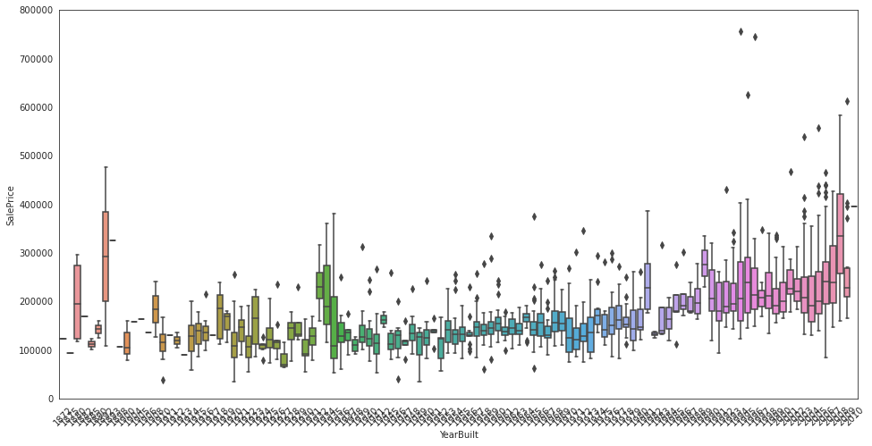

# A Gentle Introduction to Machine Learning - Predicting Real Estate Prices

If you're lucky, at some point in your life, you get the chance to purchase a property or even a house. However, here begins a painful journey of looking for your dream home and being shocked when taking a look at the price tag. When an acceptable and affordable home has been found despite the difficulties, there's still one important question: Is the price fair? If you ask the owner, it sure is. Now imagine there's a software that tells you just that. This answer is absolutely data-based and fairly objective. To do this, it's best to train a machine learning model.

{% include info.html text="<b>Machine learning, eh? So machines now go to school too?</b><br> Not exactly. Machine learning refers to a method in computer science that takes a specific piece of software called a 'model', and a data set called 'training dataset' and computes a lot of values called 'weights' used in the model to fit the training dataset. After this step, we say that the model is 'trained' and given a dataset similar to the training dataset, it can make predictions for our previously specified values of interest called 'target values'. Though not entirely accurate, in short we can say that the process of machine learning is pattern recognition in given data. This process is similar to the way humans look at a bunch of numbers and try to figure out the defining rule or pattern." %}

Suppose you'd like to purchase a house in Ames, Iowa. It just so happens that there's a great collection of housing data just for this place called the Ames Housing dataset. This dataset is a collection of almost 3,000 sold properties with up to 80 attributes recorded for each transaction. Thus, we barely need a way to train a machine learning model to 'guess' the prices of the sold properties correctly so it can give a reasonable price estimate for our dream home.

Nowadays, the most popular language used to work with machine learning models is **Python**. Python has a lot of great modules and libraries specifically developed for this and is really easy to use. The Python module **scikit-learn** is a comprehensive collection of different machine learning models. We'll train a few models and combine their estimates to get an even better result. First, we're gonna visualize the training data to get a feel for this particular data set. A few corrections to unrealistic or non-representative data points called outliers usually also need to be done at this point. Next, we'll train the models using the training set. This step can be repeated when specific parameters of the models called 'hyperparameters' were tweaked to yield better results. However, for the sake of simplicity and as a combination of models is used to make predictions, this step will be skipped in this tutorial. In the last step, 
we're gonna let the models make predictions on housing data they've never seen before but for which the 'right solution' (real sale price) is available to us. This way, we can evaluate the performance of our trained models.


# **PREDICTING HOUSE PRICES**

**In this notebook, we are going to build a machine learning model that predicts prices of houses based on historical data.**

## Data: ##
### The dataset we're gonna work with is the Ames Housing dataset. It contains 80 attributes for 2,930 properties in Ames, Iowa and was completed in 2011. The attributes include number and type of rooms, location specific data and special features of the property (pool, fireplace etc.). Each row in the dataset represents a single house. ###

## Goal: ##
### Predict sale price of a house as accurately as possible, based on data about the house features and location. ###

## Models: ##
### Based on finished notebooks available on Kaggle, it seems that a stacked model can produce even more accurate results than tuning hyperparameters of a single model. In this notebook we'll follow this approach.
### A combination of the following models will be used for superior performance: LightGBM Regressor, XGBoost Regressor, Epsilon-Support Vector Regressor, Ridge, Random Forest Regressor, Gradient Boosting Regressor.

## Evaluation: ##
### The evaluation metric is the Root-Mean-Squared-Error. The smaller the error, the better. ###

## Result: ##
### The result is a well-trained, blended machine learning model that predicts prices in the test set with a Root-Mean-Squared-Error of about 7.5%. ###


First, we import libaries.


```python
import pandas as pd
import matplotlib.pyplot as plt
import numpy as np
import seaborn as sns

from scipy import stats, special

from sklearn.model_selection import KFold, cross_val_score
from sklearn.metrics import mean_squared_error

import lightgbm as lgb
from lightgbm import LGBMRegressor
from xgboost import XGBRegressor
from sklearn.svm import SVR
from sklearn.ensemble import RandomForestRegressor, GradientBoostingRegressor
from sklearn.linear_model import Ridge, RidgeCV
from sklearn.preprocessing import RobustScaler
from mlxtend.regressor import StackingCVRegressor

from sklearn.pipeline import make_pipeline

import warnings

# Show plots in notebook
%matplotlib inline

# Ignore warnings
warnings.filterwarnings(action = "ignore")
pd.options.display.max_seq_items = 8000
pd.options.display.max_rows = 8000
```

# DATA #

Next, we import the training and test data.


```python

# Import train and test data
house_train = pd.read_csv("./data/train.csv")
house_test = pd.read_csv("./data/test.csv")
```


```python
# Take a look at the first 5 rows of the training data
house_train.head()

```


<div>
<style scoped>
    .dataframe tbody tr th:only-of-type {
        vertical-align: middle;
    }

    .dataframe tbody tr th {
        vertical-align: top;
    }

    .dataframe thead th {
        text-align: right;
    }
</style>
<table border="1" class="dataframe">
  <thead>
    <tr style="text-align: right;">
      <th></th>
      <th>Id</th>
      <th>MSSubClass</th>
      <th>MSZoning</th>
      <th>LotFrontage</th>
      <th>LotArea</th>
      <th>Street</th>
      <th>Alley</th>
      <th>LotShape</th>
      <th>LandContour</th>
      <th>Utilities</th>
      <th>...</th>
      <th>PoolArea</th>
      <th>PoolQC</th>
      <th>Fence</th>
      <th>MiscFeature</th>
      <th>MiscVal</th>
      <th>MoSold</th>
      <th>YrSold</th>
      <th>SaleType</th>
      <th>SaleCondition</th>
      <th>SalePrice</th>
    </tr>
  </thead>
  <tbody>
    <tr>
      <th>0</th>
      <td>1</td>
      <td>60</td>
      <td>RL</td>
      <td>65.0</td>
      <td>8450</td>
      <td>Pave</td>
      <td>NaN</td>
      <td>Reg</td>
      <td>Lvl</td>
      <td>AllPub</td>
      <td>...</td>
      <td>0</td>
      <td>NaN</td>
      <td>NaN</td>
      <td>NaN</td>
      <td>0</td>
      <td>2</td>
      <td>2008</td>
      <td>WD</td>
      <td>Normal</td>
      <td>208500</td>
    </tr>
    <tr>
      <th>1</th>
      <td>2</td>
      <td>20</td>
      <td>RL</td>
      <td>80.0</td>
      <td>9600</td>
      <td>Pave</td>
      <td>NaN</td>
      <td>Reg</td>
      <td>Lvl</td>
      <td>AllPub</td>
      <td>...</td>
      <td>0</td>
      <td>NaN</td>
      <td>NaN</td>
      <td>NaN</td>
      <td>0</td>
      <td>5</td>
      <td>2007</td>
      <td>WD</td>
      <td>Normal</td>
      <td>181500</td>
    </tr>
    <tr>
      <th>2</th>
      <td>3</td>
      <td>60</td>
      <td>RL</td>
      <td>68.0</td>
      <td>11250</td>
      <td>Pave</td>
      <td>NaN</td>
      <td>IR1</td>
      <td>Lvl</td>
      <td>AllPub</td>
      <td>...</td>
      <td>0</td>
      <td>NaN</td>
      <td>NaN</td>
      <td>NaN</td>
      <td>0</td>
      <td>9</td>
      <td>2008</td>
      <td>WD</td>
      <td>Normal</td>
      <td>223500</td>
    </tr>
    <tr>
      <th>3</th>
      <td>4</td>
      <td>70</td>
      <td>RL</td>
      <td>60.0</td>
      <td>9550</td>
      <td>Pave</td>
      <td>NaN</td>
      <td>IR1</td>
      <td>Lvl</td>
      <td>AllPub</td>
      <td>...</td>
      <td>0</td>
      <td>NaN</td>
      <td>NaN</td>
      <td>NaN</td>
      <td>0</td>
      <td>2</td>
      <td>2006</td>
      <td>WD</td>
      <td>Abnorml</td>
      <td>140000</td>
    </tr>
    <tr>
      <th>4</th>
      <td>5</td>
      <td>60</td>
      <td>RL</td>
      <td>84.0</td>
      <td>14260</td>
      <td>Pave</td>
      <td>NaN</td>
      <td>IR1</td>
      <td>Lvl</td>
      <td>AllPub</td>
      <td>...</td>
      <td>0</td>
      <td>NaN</td>
      <td>NaN</td>
      <td>NaN</td>
      <td>0</td>
      <td>12</td>
      <td>2008</td>
      <td>WD</td>
      <td>Normal</td>
      <td>250000</td>
    </tr>
  </tbody>
</table>
<p>5 rows × 81 columns</p>
</div>


```python
house_test.head()

```


<div>
<style scoped>
    .dataframe tbody tr th:only-of-type {
        vertical-align: middle;
    }

    .dataframe tbody tr th {
        vertical-align: top;
    }

    .dataframe thead th {
        text-align: right;
    }
</style>
<table border="1" class="dataframe">
  <thead>
    <tr style="text-align: right;">
      <th></th>
      <th>Id</th>
      <th>MSSubClass</th>
      <th>MSZoning</th>
      <th>LotFrontage</th>
      <th>LotArea</th>
      <th>Street</th>
      <th>Alley</th>
      <th>LotShape</th>
      <th>LandContour</th>
      <th>Utilities</th>
      <th>...</th>
      <th>ScreenPorch</th>
      <th>PoolArea</th>
      <th>PoolQC</th>
      <th>Fence</th>
      <th>MiscFeature</th>
      <th>MiscVal</th>
      <th>MoSold</th>
      <th>YrSold</th>
      <th>SaleType</th>
      <th>SaleCondition</th>
    </tr>
  </thead>
  <tbody>
    <tr>
      <th>0</th>
      <td>1461</td>
      <td>20</td>
      <td>RH</td>
      <td>80.0</td>
      <td>11622</td>
      <td>Pave</td>
      <td>NaN</td>
      <td>Reg</td>
      <td>Lvl</td>
      <td>AllPub</td>
      <td>...</td>
      <td>120</td>
      <td>0</td>
      <td>NaN</td>
      <td>MnPrv</td>
      <td>NaN</td>
      <td>0</td>
      <td>6</td>
      <td>2010</td>
      <td>WD</td>
      <td>Normal</td>
    </tr>
    <tr>
      <th>1</th>
      <td>1462</td>
      <td>20</td>
      <td>RL</td>
      <td>81.0</td>
      <td>14267</td>
      <td>Pave</td>
      <td>NaN</td>
      <td>IR1</td>
      <td>Lvl</td>
      <td>AllPub</td>
      <td>...</td>
      <td>0</td>
      <td>0</td>
      <td>NaN</td>
      <td>NaN</td>
      <td>Gar2</td>
      <td>12500</td>
      <td>6</td>
      <td>2010</td>
      <td>WD</td>
      <td>Normal</td>
    </tr>
    <tr>
      <th>2</th>
      <td>1463</td>
      <td>60</td>
      <td>RL</td>
      <td>74.0</td>
      <td>13830</td>
      <td>Pave</td>
      <td>NaN</td>
      <td>IR1</td>
      <td>Lvl</td>
      <td>AllPub</td>
      <td>...</td>
      <td>0</td>
      <td>0</td>
      <td>NaN</td>
      <td>MnPrv</td>
      <td>NaN</td>
      <td>0</td>
      <td>3</td>
      <td>2010</td>
      <td>WD</td>
      <td>Normal</td>
    </tr>
    <tr>
      <th>3</th>
      <td>1464</td>
      <td>60</td>
      <td>RL</td>
      <td>78.0</td>
      <td>9978</td>
      <td>Pave</td>
      <td>NaN</td>
      <td>IR1</td>
      <td>Lvl</td>
      <td>AllPub</td>
      <td>...</td>
      <td>0</td>
      <td>0</td>
      <td>NaN</td>
      <td>NaN</td>
      <td>NaN</td>
      <td>0</td>
      <td>6</td>
      <td>2010</td>
      <td>WD</td>
      <td>Normal</td>
    </tr>
    <tr>
      <th>4</th>
      <td>1465</td>
      <td>120</td>
      <td>RL</td>
      <td>43.0</td>
      <td>5005</td>
      <td>Pave</td>
      <td>NaN</td>
      <td>IR1</td>
      <td>HLS</td>
      <td>AllPub</td>
      <td>...</td>
      <td>144</td>
      <td>0</td>
      <td>NaN</td>
      <td>NaN</td>
      <td>NaN</td>
      <td>0</td>
      <td>1</td>
      <td>2010</td>
      <td>WD</td>
      <td>Normal</td>
    </tr>
  </tbody>
</table>
<p>5 rows × 80 columns</p>
</div>


```python
# Take a look at additional info regarding the training data
house_train.info()
```

    <class 'pandas.core.frame.DataFrame'>
    RangeIndex: 1460 entries, 0 to 1459
    Data columns (total 81 columns):
     #   Column         Non-Null Count  Dtype  
    ---  ------         --------------  -----  
     0   Id             1460 non-null   int64  
     1   MSSubClass     1460 non-null   int64  
     2   MSZoning       1460 non-null   object 
     3   LotFrontage    1201 non-null   float64
     4   LotArea        1460 non-null   int64  
     5   Street         1460 non-null   object 
     6   Alley          91 non-null     object 
     7   LotShape       1460 non-null   object 
     8   LandContour    1460 non-null   object 
     9   Utilities      1460 non-null   object 
     10  LotConfig      1460 non-null   object 
     11  LandSlope      1460 non-null   object 
     12  Neighborhood   1460 non-null   object 
     13  Condition1     1460 non-null   object 
     14  Condition2     1460 non-null   object 
     15  BldgType       1460 non-null   object 
     16  HouseStyle     1460 non-null   object 
     17  OverallQual    1460 non-null   int64  
     18  OverallCond    1460 non-null   int64  
     19  YearBuilt      1460 non-null   int64  
     20  YearRemodAdd   1460 non-null   int64  
     21  RoofStyle      1460 non-null   object 
     22  RoofMatl       1460 non-null   object 
     23  Exterior1st    1460 non-null   object 
     24  Exterior2nd    1460 non-null   object 
     25  MasVnrType     1452 non-null   object 
     26  MasVnrArea     1452 non-null   float64
     27  ExterQual      1460 non-null   object 
     28  ExterCond      1460 non-null   object 
     29  Foundation     1460 non-null   object 
     30  BsmtQual       1423 non-null   object 
     31  BsmtCond       1423 non-null   object 
     32  BsmtExposure   1422 non-null   object 
     33  BsmtFinType1   1423 non-null   object 
     34  BsmtFinSF1     1460 non-null   int64  
     35  BsmtFinType2   1422 non-null   object 
     36  BsmtFinSF2     1460 non-null   int64  
     37  BsmtUnfSF      1460 non-null   int64  
     38  TotalBsmtSF    1460 non-null   int64  
     39  Heating        1460 non-null   object 
     40  HeatingQC      1460 non-null   object 
     41  CentralAir     1460 non-null   object 
     42  Electrical     1459 non-null   object 
     43  1stFlrSF       1460 non-null   int64  
     44  2ndFlrSF       1460 non-null   int64  
     45  LowQualFinSF   1460 non-null   int64  
     46  GrLivArea      1460 non-null   int64  
     47  BsmtFullBath   1460 non-null   int64  
     48  BsmtHalfBath   1460 non-null   int64  
     49  FullBath       1460 non-null   int64  
     50  HalfBath       1460 non-null   int64  
     51  BedroomAbvGr   1460 non-null   int64  
     52  KitchenAbvGr   1460 non-null   int64  
     53  KitchenQual    1460 non-null   object 
     54  TotRmsAbvGrd   1460 non-null   int64  
     55  Functional     1460 non-null   object 
     56  Fireplaces     1460 non-null   int64  
     57  FireplaceQu    770 non-null    object 
     58  GarageType     1379 non-null   object 
     59  GarageYrBlt    1379 non-null   float64
     60  GarageFinish   1379 non-null   object 
     61  GarageCars     1460 non-null   int64  
     62  GarageArea     1460 non-null   int64  
     63  GarageQual     1379 non-null   object 
     64  GarageCond     1379 non-null   object 
     65  PavedDrive     1460 non-null   object 
     66  WoodDeckSF     1460 non-null   int64  
     67  OpenPorchSF    1460 non-null   int64  
     68  EnclosedPorch  1460 non-null   int64  
     69  3SsnPorch      1460 non-null   int64  
     70  ScreenPorch    1460 non-null   int64  
     71  PoolArea       1460 non-null   int64  
     72  PoolQC         7 non-null      object 
     73  Fence          281 non-null    object 
     74  MiscFeature    54 non-null     object 
     75  MiscVal        1460 non-null   int64  
     76  MoSold         1460 non-null   int64  
     77  YrSold         1460 non-null   int64  
     78  SaleType       1460 non-null   object 
     79  SaleCondition  1460 non-null   object 
     80  SalePrice      1460 non-null   int64  
    dtypes: float64(3), int64(35), object(43)
    memory usage: 924.0+ KB


```python
# Plot a histogram of the target column (SalePrice)
sns.set_style("white")
sns.set_color_codes(palette = "deep")
fig, ax = plt.subplots(figsize = [8, 7])
sns.histplot(house_train["SalePrice"], kde = "True", color = "b") # kde: Kernel Density Estimate
                                                                  # not using displot because that's a figure-level function
ax.xaxis.grid(False)
ax.set(ylabel = "Frequency")
ax.set(xlabel = "SalePrice")
ax.set(title = "SalePrice distribution")
sns.despine(trim = True, left = True)
plt.show()

```


    

    


```python
# Look at how spread out and symmetric the graph is
print("Kurtosis: %f" % house_train["SalePrice"].kurt())
print("Skewness: %f" % house_train["SalePrice"].skew())
```

    Kurtosis: 6.536282
    Skewness: 1.882876


The kurtosis and skewness values tell us that the distribution has a pretty sharp peak and that it is "leaning" to the left, i. e., there is a high number of cheaper houses and there are a few extremely expensive ones.


Now, let's look at the features. Start by getting to know numeric features.


```python
# Filter numeric features
numeric_datatypes = ["int16", "int32", "int64", "float16", "float32", "float64"]
numeric_cols = []
for i in house_train.columns:
    if house_train[i].dtype in numeric_datatypes:
        if i in ["TotalSF", "Total_Bathrooms","Total_porch_sf","haspool","hasgarage","hasbsmt","hasfireplace"]:
            pass
        else:
            numeric_cols.append(i)     
```

Now, let's look at the correlation between features of the houses and the sale price. To do this, we plot the distribution of the numeric data. Data points far away from the rest are called outliers and make predictions harder.


```python
# Plot numeric data

fig, ax = plt.subplots(ncols = 2, nrows = 1, figsize = (12, 120))
plt.subplots_adjust(right = 2)
plt.subplots_adjust(top = 2)
sns.color_palette("husl", 8)
for i, feature in enumerate(list(house_train[numeric_cols]), 1):
    if(feature == "MiscVal"):
        break
    plt.subplot(len(list(numeric_cols)), 3, i)
    sns.scatterplot(x = feature, y = "SalePrice", hue = "SalePrice", palette = "Blues", data = house_train)
        
    plt.xlabel("{}".format(feature), size = 15,labelpad = 12.5)
    plt.ylabel("SalePrice", size = 15, labelpad = 12.5)
    
    for j in range(2):
        plt.tick_params(axis = "x", labelsize = 12)
        plt.tick_params(axis = "y", labelsize = 12)
    
    plt.legend(loc = "best", prop = {"size": 10})
        
plt.show()
```


    

    


Let's analyze this topic also with the help of a correlation matrix.


```python
corr_matrix = house_train.corr()
plt.subplots(figsize = (15, 12))
sns.heatmap(corr_matrix, vmax = 0.9, cmap = "Blues", square = True);
```


    

    


We can see that the feature that correlates the strongest with the sale price is overall quality, which shouldn't come as a surprise. The second most influental on the sale price is the gross living area, which is also something we could suspect.

Let's analyze strongly correlating features more closely.


```python
data = pd.concat([house_train["SalePrice"], house_train["OverallQual"]], axis = 1)
f, ax = plt.subplots(figsize = (8, 6))
fig = sns.boxplot(x = house_train["OverallQual"], y = house_train["SalePrice"], data = data)
fig.axis(ymin = 0, ymax = 800000);
```


    

    


```python
data = pd.concat([house_train["SalePrice"], house_train["YearBuilt"]], axis = 1)
f, ax = plt.subplots(figsize = (16, 8))
fig = sns.boxplot(x = house_train["YearBuilt"], y = house_train["SalePrice"], data = data)
fig.axis(ymin = 0, ymax = 800000)
plt.xticks(rotation = 45);


```


    

    


```python
data = pd.concat([house_train["SalePrice"], house_train["TotalBsmtSF"]], axis = 1)
data.plot.scatter(x = "TotalBsmtSF", y = "SalePrice", alpha = 0.3, ylim = (0, 800000));
```


    

    


```python
data = pd.concat([house_train["SalePrice"], house_train["LotArea"]], axis = 1)
data.plot.scatter(x = "LotArea", y = "SalePrice", alpha = 0.3, ylim = (0, 800000));
```


    

    


```python
data = pd.concat([house_train["SalePrice"], house_train["GrLivArea"]], axis = 1)
data.plot.scatter(x = "GrLivArea", y = "SalePrice", alpha = 0.3, ylim = (0, 800000));
```


    

    


Now, let's prepare our data for model training.
First, we need to remove the IDs as we won't be using them to train our models.


```python
house_train.reset_index(drop = True, inplace = True)
house_test.reset_index(drop = True, inplace = True)
house_train.shape, house_test.shape

```


    ((1460, 81), (1459, 80))


# FEATURE ENGINEERING

Now it's time to do some feature engineering. Let's look again at the plot of the target column (sale price).


```python
sns.set_style("white")
sns.set_color_codes(palette = "deep")
fig, ax = plt.subplots(figsize = (8, 7))
sns.histplot(house_train["SalePrice"], color = "b", kde = True);
ax.xaxis.grid(False)
ax.set(ylabel = "Frequency")
ax.set(xlabel = "SalePrice")
ax.set(title = "SalePrice distribution")
sns.despine(trim = True, left = True)
plt.show()
```


    

    


As we can see from the image above, the sale price graph is positively skewed. This can be a problem as most machine learning models don't do well on normal distributions with significant skew.
To change this, we can take the logarithm of the sale price.


```python
house_train["SalePrice"] = np.log1p(house_train["SalePrice"])
```


```python
# Define function to plot a normal distribution

def normal(mean, std, color = "black"):
    x = np.linspace(mean - 4 * std, mean + 4 * std, 200)
    p = stats.norm.pdf(x, mean, std)
    z = plt.plot(x, p, color, linewidth = 2)

sns.set_style("white")
sns.set_color_codes(palette = "deep")
fig, ax = plt.subplots(figsize = (8, 7))
sns.histplot(house_train["SalePrice"], stat = "density", color = "b", kde = True)
ax.xaxis.grid(False)
ax.set(xlabel = "Sale Price", ylabel = "Frequency", title = "Sale Price Distribution")
sns.despine(trim = True, left = True)

# Plot normal distribution with no skew or kurtosis
normal(house_train["SalePrice"].mean(), house_train["SalePrice"].std())

plt.show();
```


    

    


In the next step, we're gonna remove outliers. These are single data points far away from the rest of the data and are therefore not representative for the dataset as a whole.
There are multiple methods to determine which data point exactly is an outlier. Some examples are:

* IQR Testing
* Grubbs Test
* Isolation Forest
* Z-Score Method

In this notebook, a variation of the Z-score method will be used. This means that we look at how far away a data point is from the mean in terms of standard deviation. If the distance is more than a pre-defined value, we discard the data point.
In particular, if a house is in really poor condition (overall quality) and really expensive (sale price) at the same time, there must be something special about the house that isn't true for most of the properties. Similarly, if a house is really big (gross living area) but also really cheap, it's probably not representative for out dataset as a whole. For this reason, we will discard these data points. We're gonna define these cut-off values through an educated guess (based on the above graphs) and see if we get a good result.


```python
# Drop outliers
house_train.drop(house_train[(house_train["OverallQual"] < 5) & (house_train["SalePrice"] > 200000)].index, inplace = True)
house_train.drop(house_train[(house_train["GrLivArea"] > 4500) & (house_train["SalePrice"] < 300000)].index, inplace = True)
house_train.reset_index(drop = True, inplace = True)
```


```python
# Create labels and features containers
house_train_labels = house_train["SalePrice"].reset_index(drop = True)
house_train_features = house_train.drop(["SalePrice"], axis = 1)
house_test_features = house_test

# Combine train and test features in order to apply the feature transformation pipeline to the entire dataset
all_features = pd.concat([house_train_features, house_test_features]).reset_index(drop = True)
all_features.shape
```


    (2917, 80)


In large datasets, there are usually gaps in the data where values couldn't be determined or just haven't been supplied. The performance of machine learning algorithms suffers heavily from such missing data. For this reason, we're gonna make an estimate or determine missing values in the dataset and fill in the gaps. This can happen through one of the following methods:

* calculate missing values based on a known formula
* assume missing values to be equal to the mean/median of the values in the column of the missing value
* assume missing values to be equal to 0 ("default: missing" option)

We're going to a mixture of these in the following steps.


```python
# Determine fraction of missing values
def missingCalc(df):
    data = pd.DataFrame(df)
    df_cols = list(pd.DataFrame(data))
    missing_fractions = {}
    for i in range(len(df_cols)):
        missing_fractions.update({df_cols[i]: round(data[df_cols[i]].isnull().mean()*100,2)})
    
    return missing_fractions

missing = missingCalc(all_features)
df_miss = sorted(missing.items(), key = lambda x: x[1], reverse = True)
print("Percentage of missing data")
df_miss[:10]


```

    Percentage of missing data


    [('PoolQC', 99.69),
     ('MiscFeature', 96.4),
     ('Alley', 93.21),
     ('Fence', 80.43),
     ('FireplaceQu', 48.68),
     ('LotFrontage', 16.66),
     ('GarageYrBlt', 5.45),
     ('GarageFinish', 5.45),
     ('GarageQual', 5.45),
     ('GarageCond', 5.45)]


There's quite a lot data missing. Let's visualize that.


```python
# Visualize missing values
sns.set_style("white")
sns.set_color_codes(palette = "deep")
fig, ax = plt.subplots(figsize = (8, 7))
missing = round(house_train.isnull().mean() * 100, 2)
missing = missing[missing > 0]
missing.sort_values(inplace = True)
missing.plot.bar(color = "b")
ax.xaxis.grid(False)
ax.set(ylabel = "Percentage of missing values")
ax.set(xlabel = "Features")
ax.set(title = "Percentage of missing data by feature")
sns.despine(trim = True, left = True)
```


    

    


Now we're gonna convert non-numeical features stored as numbers to strings to reflect the nature of the data.


```python
# Convert non-numeric columns that store values as numbers to strings
all_features["MSSubClass"] = all_features["MSSubClass"].apply(str)
all_features["YrSold"] = all_features["YrSold"].astype(str)
all_features["MoSold"] = all_features["MoSold"].astype(str)
```

We now can fill the gaps in the data with suitable values. Let's define a function that can achieve this.


```python

def fillMissingData(features):
    
    # The data description states that "NA" refers to typical ("Typ") values
    features["Functional"] = features["Functional"].fillna("Typ")

    # Replace the missing values in each of the columns below with their mode
    features["Electrical"] = features["Electrical"].fillna("SBrkr")
    features["KitchenQual"] = features["KitchenQual"].fillna("TA")
    features["Exterior1st"] = features["Exterior1st"].fillna(features["Exterior1st"].mode()[0])
    features["Exterior2nd"] = features["Exterior2nd"].fillna(features["Exterior2nd"].mode()[0])
    features["SaleType"] = features["SaleType"].fillna(features["SaleType"].mode()[0])
    features["MSZoning"] = features.groupby("MSSubClass")["MSZoning"].transform(lambda x: x.fillna(x.mode()[0]))

    # The data description states that "NA" refers to "No Pool"
    features["PoolQC"] = features["PoolQC"].fillna("None")

    # Replacing the missing values with 0, since no garage = no cars in garage
    for col in ("GarageYrBlt", "GarageArea", "GarageCars"):
        features[col] = features[col].fillna(0)

    # Replacing the missing values with "None"
    for col in ["GarageType", "GarageFinish", "GarageQual", "GarageCond"]:
        features[col] = features[col].fillna("None")

    # "NaN" values for these categorical basement features mean there's no basement
    for col in ("BsmtQual", "BsmtCond", "BsmtExposure", "BsmtFinType1", "BsmtFinType2"):
        features[col] = features[col].fillna("None")
        
    # Group features by neighborhood, and fill missing value by the median LotFrontage of the neighborhood
    features["LotFrontage"] = features.groupby("Neighborhood")["LotFrontage"].transform(lambda x: x.fillna(x.median()))

    # For the missing values in the rest of the categorical features, there's not enough information to fill them properly, so they're filled with "None"
    objects = []
    for i in features.columns:
        if features[i].dtype == object:
            objects.append(i)
    features.update(features[objects].fillna("None"))
        
    # The same is true for the numerical features, so the gaps are filled with zeros
    numeric_dtypes = ["int16", "int32", "int64", "float16", "float32", "float64"]
    numeric = []
    for i in features.columns:
        if features[i].dtype in numeric_dtypes:
            numeric.append(i)
    features.update(features[numeric].fillna(0))    
    return features

all_features = fillMissingData(all_features)

```


```python
# Check if we handled all the missing values
missing = missingCalc(all_features)
missing_sorted = sorted(missing.items(), key = lambda x: x[1], reverse = True)
print("Percentage of missing data")
missing_sorted[:10]

```

    Percentage of missing data


    [('Id', 0.0),
     ('MSSubClass', 0.0),
     ('MSZoning', 0.0),
     ('LotFrontage', 0.0),
     ('LotArea', 0.0),
     ('Street', 0.0),
     ('Alley', 0.0),
     ('LotShape', 0.0),
     ('LandContour', 0.0),
     ('Utilities', 0.0)]


We can see that there are no more missing values, so we can move on to the next step: fixing skewed features.


```python
# Fetch all numeric features
numeric_dtypes = ["int16", "int32", "int64", "float16", "float32", "float64"]
numeric = []
for i in all_features.columns:
    if all_features[i].dtype in numeric_dtypes:
        numeric.append(i)
```


```python


# Create box plots for all numeric features
sns.set_style("white")
f, ax = plt.subplots(figsize = (8, 7))
ax.set_xscale("log")
ax = sns.boxplot(data = all_features[numeric] , orient = "h", palette = "Set1")
ax.xaxis.grid(False)
ax.set(ylabel = "Feature names")
ax.set(xlabel = "Numeric values")
ax.set(title = "Numeric distribution of features")
sns.despine(trim = True, left = True)


```


    

    


```python


# Find skewed numerical features
skew_features = all_features[numeric].apply(lambda x: stats.skew(x)).sort_values(ascending=False)

high_skew = skew_features[skew_features > 0.5]
skew_index = high_skew.index

print("There are {} numerical features with skew > 0.5: ".format(high_skew.shape[0]))
skewness = pd.DataFrame({"Skew": high_skew})
skew_features.head(10)


```

    There are 25 numerical features with skew > 0.5: 


    MiscVal          21.939672
    PoolArea         17.688664
    LotArea          13.109495
    LowQualFinSF     12.084539
    3SsnPorch        11.372080
    KitchenAbvGr      4.300550
    BsmtFinSF2        4.144503
    EnclosedPorch     4.002344
    ScreenPorch       3.945101
    BsmtHalfBath      3.929996
    dtype: float64


The skewed features should be nomalized for the machine learning models to perform well.


```python
# Normalize skewed features
for i in skew_index:
    all_features[i] = special.boxcox1p(all_features[i], stats.boxcox_normmax(all_features[i] + 1))
```

    /usr/lib/python3/dist-packages/scipy/stats/_stats_py.py:4068: PearsonRConstantInputWarning: An input array is constant; the correlation coefficient is not defined.
      warnings.warn(PearsonRConstantInputWarning())
    /usr/lib/python3/dist-packages/scipy/stats/_stats_py.py:4098: PearsonRNearConstantInputWarning: An input array is nearly constant; the computed correlation coefficient may be inaccurate.
      warnings.warn(PearsonRNearConstantInputWarning())


```python
# Let's make sure we handled all the skewed values
sns.set_style("white")
f, ax = plt.subplots(figsize = (8, 7))
ax.set_xscale("log")
ax = sns.boxplot(data = all_features[skew_index] , orient = "h", palette = "Set1")
ax.xaxis.grid(False)
ax.set(ylabel = "Feature names")
ax.set(xlabel = "Numeric values")
ax.set(title = "Numeric Distribution of Features")
sns.despine(trim = True, left = True)
```


    

    


# CREATING INTERESTING FEATURES

To help the machine learning models recognize complex pattens, we're gonna create some features we think could be of significance for the price of the house (e. g., total area of rooms).


```python
all_features["BsmtFinType1_Unf"] = (all_features["BsmtFinType1"] == "Unf") * 1
all_features["HasWoodDeck"] = (all_features["WoodDeckSF"] == 0) * 1
all_features["HasOpenPorch"] = (all_features["OpenPorchSF"] == 0) * 1
all_features["HasEnclosedPorch"] = (all_features["EnclosedPorch"] == 0) * 1
all_features["Has3SsnPorch"] = (all_features["3SsnPorch"] == 0) * 1
all_features["HasScreenPorch"] = (all_features["ScreenPorch"] == 0) * 1
all_features["YearsSinceRemodel"] = all_features["YrSold"].astype(int) - all_features["YearRemodAdd"].astype(int)
all_features["Total_Home_Quality"] = all_features["OverallQual"] + all_features["OverallCond"]
all_features = all_features.drop(["Utilities", "Street", "PoolQC",], axis = 1)
all_features["TotalSF"] = all_features["TotalBsmtSF"] + all_features["1stFlrSF"] + all_features["2ndFlrSF"]
all_features["YrBltAndRemod"] = all_features["YearBuilt"] + all_features["YearRemodAdd"]

all_features["Total_sqr_footage"] = (all_features["BsmtFinSF1"] + all_features["BsmtFinSF2"] +
                                 all_features["1stFlrSF"] + all_features["2ndFlrSF"])
all_features["Total_Bathrooms"] = (all_features["FullBath"] + (0.5 * all_features["HalfBath"]) +
                               all_features["BsmtFullBath"] + (0.5 * all_features["BsmtHalfBath"]))
all_features["Total_porch_sf"] = (all_features["OpenPorchSF"] + all_features["3SsnPorch"] +
                              all_features["EnclosedPorch"] + all_features["ScreenPorch"] +
                              all_features["WoodDeckSF"])
all_features["TotalBsmtSF"] = all_features["TotalBsmtSF"].apply(lambda x: np.exp(6) if x <= 0.0 else x)
all_features["2ndFlrSF"] = all_features["2ndFlrSF"].apply(lambda x: np.exp(6.5) if x <= 0.0 else x)
all_features["GarageArea"] = all_features["GarageArea"].apply(lambda x: np.exp(6) if x <= 0.0 else x)
all_features["GarageCars"] = all_features["GarageCars"].apply(lambda x: 0 if x <= 0.0 else x)
all_features["LotFrontage"] = all_features["LotFrontage"].apply(lambda x: np.exp(4.2) if x <= 0.0 else x)
all_features["MasVnrArea"] = all_features["MasVnrArea"].apply(lambda x: np.exp(4) if x <= 0.0 else x)
all_features["BsmtFinSF1"] = all_features["BsmtFinSF1"].apply(lambda x: np.exp(6.5) if x <= 0.0 else x)

all_features["haspool"] = all_features["PoolArea"].apply(lambda x: 1 if x > 0 else 0)
all_features["has2ndfloor"] = all_features["2ndFlrSF"].apply(lambda x: 1 if x > 0 else 0)
all_features["hasgarage"] = all_features["GarageArea"].apply(lambda x: 1 if x > 0 else 0)
all_features["hasbsmt"] = all_features["TotalBsmtSF"].apply(lambda x: 1 if x > 0 else 0)
all_features["hasfireplace"] = all_features["Fireplaces"].apply(lambda x: 1 if x > 0 else 0)
```

## Transform features

Now we're gonna create some more features. These will be the squares of the logs of numerical features because they will be almost normally distributed after the transformation.


```python
def createLog(res, ls):
    m = res.shape[1]
    for l in ls:
        res = res.assign(newcol = pd.Series(np.log(1.01+res[l])).values)   
        res.columns.values[m] = l + "_log"
        m += 1
    return res

log_features = ["LotFrontage", "LotArea", "MasVnrArea", "BsmtFinSF1", "BsmtFinSF2", "BsmtUnfSF", 
                 "TotalBsmtSF", "1stFlrSF", "2ndFlrSF", "LowQualFinSF", "GrLivArea", 
                 "BsmtFullBath", "BsmtHalfBath", "FullBath", "HalfBath", "BedroomAbvGr", "KitchenAbvGr", 
                 "TotRmsAbvGrd", "Fireplaces", "GarageCars", "GarageArea", "WoodDeckSF", "OpenPorchSF", 
                 "EnclosedPorch", "3SsnPorch", "ScreenPorch", "PoolArea", "MiscVal", "YearRemodAdd", "TotalSF"]

all_features = createLog(all_features, log_features)
```


```python
def createSquare(res, ls):
    m = res.shape[1]
    for l in ls:
        res = res.assign(newcol = pd.Series(res[l] * res[l]).values)   
        res.columns.values[m] = l + "_sq"
        m += 1
    return res

squared_features = ["YearRemodAdd", "LotFrontage_log", 
                    "TotalBsmtSF_log", "1stFlrSF_log", "2ndFlrSF_log", "GrLivArea_log",
                    "GarageCars_log", "GarageArea_log"]

all_features = createSquare(all_features, squared_features)

```


```python
all_features = pd.get_dummies(all_features).reset_index(drop = True)
all_features.shape
```


    (2917, 380)


```python
all_features.head()
```


<div>
<style scoped>
    .dataframe tbody tr th:only-of-type {
        vertical-align: middle;
    }

    .dataframe tbody tr th {
        vertical-align: top;
    }

    .dataframe thead th {
        text-align: right;
    }
</style>
<table border="1" class="dataframe">
  <thead>
    <tr style="text-align: right;">
      <th></th>
      <th>Id</th>
      <th>LotFrontage</th>
      <th>LotArea</th>
      <th>OverallQual</th>
      <th>OverallCond</th>
      <th>YearBuilt</th>
      <th>YearRemodAdd</th>
      <th>MasVnrArea</th>
      <th>BsmtFinSF1</th>
      <th>BsmtFinSF2</th>
      <th>...</th>
      <th>SaleType_ConLw</th>
      <th>SaleType_New</th>
      <th>SaleType_Oth</th>
      <th>SaleType_WD</th>
      <th>SaleCondition_Abnorml</th>
      <th>SaleCondition_AdjLand</th>
      <th>SaleCondition_Alloca</th>
      <th>SaleCondition_Family</th>
      <th>SaleCondition_Normal</th>
      <th>SaleCondition_Partial</th>
    </tr>
  </thead>
  <tbody>
    <tr>
      <th>0</th>
      <td>1</td>
      <td>18.144573</td>
      <td>13.833054</td>
      <td>7</td>
      <td>3.991517</td>
      <td>2003</td>
      <td>2003</td>
      <td>19.433175</td>
      <td>144.117862</td>
      <td>0.0</td>
      <td>...</td>
      <td>0</td>
      <td>0</td>
      <td>0</td>
      <td>1</td>
      <td>0</td>
      <td>0</td>
      <td>0</td>
      <td>0</td>
      <td>1</td>
      <td>0</td>
    </tr>
    <tr>
      <th>1</th>
      <td>2</td>
      <td>20.673625</td>
      <td>14.117918</td>
      <td>6</td>
      <td>6.000033</td>
      <td>1976</td>
      <td>1976</td>
      <td>54.598150</td>
      <td>181.719186</td>
      <td>0.0</td>
      <td>...</td>
      <td>0</td>
      <td>0</td>
      <td>0</td>
      <td>1</td>
      <td>0</td>
      <td>0</td>
      <td>0</td>
      <td>0</td>
      <td>1</td>
      <td>0</td>
    </tr>
    <tr>
      <th>2</th>
      <td>3</td>
      <td>18.668047</td>
      <td>14.476512</td>
      <td>7</td>
      <td>3.991517</td>
      <td>2001</td>
      <td>2002</td>
      <td>17.768840</td>
      <td>110.441033</td>
      <td>0.0</td>
      <td>...</td>
      <td>0</td>
      <td>0</td>
      <td>0</td>
      <td>1</td>
      <td>0</td>
      <td>0</td>
      <td>0</td>
      <td>0</td>
      <td>1</td>
      <td>0</td>
    </tr>
    <tr>
      <th>3</th>
      <td>4</td>
      <td>17.249651</td>
      <td>14.106196</td>
      <td>7</td>
      <td>3.991517</td>
      <td>1915</td>
      <td>1970</td>
      <td>54.598150</td>
      <td>61.795315</td>
      <td>0.0</td>
      <td>...</td>
      <td>0</td>
      <td>0</td>
      <td>0</td>
      <td>1</td>
      <td>1</td>
      <td>0</td>
      <td>0</td>
      <td>0</td>
      <td>0</td>
      <td>0</td>
    </tr>
    <tr>
      <th>4</th>
      <td>5</td>
      <td>21.314283</td>
      <td>15.022008</td>
      <td>8</td>
      <td>3.991517</td>
      <td>2000</td>
      <td>2000</td>
      <td>25.404164</td>
      <td>136.624601</td>
      <td>0.0</td>
      <td>...</td>
      <td>0</td>
      <td>0</td>
      <td>0</td>
      <td>1</td>
      <td>0</td>
      <td>0</td>
      <td>0</td>
      <td>0</td>
      <td>1</td>
      <td>0</td>
    </tr>
  </tbody>
</table>
<p>5 rows × 380 columns</p>
</div>


```python
all_features.shape
```


    (2917, 380)


```python
# Remove any duplicated column names
all_features = all_features.loc[:,~all_features.columns.duplicated()]

```


```python
all_features.shape
```


    (2917, 379)


Now, we have to reassemble the training and test data sets.


```python
X_train = all_features.iloc[:len(house_train_labels), :]
X_test = all_features.iloc[len(house_train_labels):, :]
X_train.shape, house_train_labels.shape, X_test.shape
```


    ((1458, 379), (1458,), (1459, 379))


Before we begin training, let's visualize the data once more.


```python
# Find numeric features
numeric = []
for i in X_train.columns:
    if X_train[i].dtype in numeric_dtypes:
        if i in ["TotalSF", "Total_Bathrooms", "Total_porch_sf", "haspool", "hasgarage", "hasbsmt", "hasfireplace"]:
            pass
        else:
            numeric.append(i)

# Visualize some more outliers in the data
fig, axs = plt.subplots(ncols = 2, nrows = 1, figsize = (12, 150))
plt.subplots_adjust(right = 2)
plt.subplots_adjust(top = 2)
sns.color_palette("husl", 8)
for i, feature in enumerate(list(X_train[numeric]), 1):
    if(feature == "MiscVal"):
        break
    plt.subplot(len(list(numeric)), 3, i)
    sns.scatterplot(x = feature, y = "SalePrice", hue = "SalePrice", palette = "Blues", data = house_train)
        
    plt.xlabel("{}".format(feature), size = 15,labelpad = 12.5)
    plt.ylabel("SalePrice", size = 15, labelpad = 12.5)
    
    for j in range(2):
        plt.tick_params(axis = "x", labelsize = 12)
        plt.tick_params(axis = "y", labelsize = 12)
    
    plt.legend(loc = "best", prop = {"size": 10})
        
plt.show()
```


    

    


# TRAINING MODELS

7 models are to be trained:  lightgbm regressor, xgboost, ridge, gradient boosting, svr, and random forest. A meta StackingCVRegressor is also gonna be trained. Fo the end result, the predictions of the 7 models will be weighted according to their overall performance. 12-fold cross-validation will be used to determine the performance of the models. 10-fold cross-validation is used to get a more realistic idea of the performance of the models.


```python
# Set up cross validation folds
kf = KFold(n_splits = 10, random_state = 42, shuffle = True)
```


```python
# Define error metrics
def rmsle(y, y_pred):
    return np.sqrt(mean_squared_error(y, y_pred))

def cv_rmse(model, X = X_train):
    rmse = np.sqrt(-cross_val_score(model, X, house_train_labels, scoring = "neg_mean_squared_error", cv = kf))
    return (rmse)
```


```python
# Set up models

# Light Gradient Boosting Regressor
lightgbm = LGBMRegressor(objective = "regression", 
                       num_leaves = 6,
                       learning_rate = 0.01, 
                       n_estimators = 7000,
                       max_bin = 200, 
                       bagging_fraction = 0.8,
                       bagging_freq = 4, 
                       bagging_seed = 8,
                       feature_fraction = 0.2,
                       feature_fraction_seed = 8,
                       min_sum_hessian_in_leaf = 11,
                       verbose = -1,
                       random_state = 42)

# XGBoost Regressor
xgboost = XGBRegressor(learning_rate = 0.01,
                       n_estimators = 6000,
                       max_depth = 4,
                       min_child_weight = 0,
                       gamma = 0.6,
                       subsample = 0.7,
                       colsample_bytree = 0.7,
                       objective = "reg:squarederror",
                       nthread = -1,
                       scale_pos_weight = 1,
                       seed = 27,
                       reg_alpha = 0.00006,
                       random_state = 42)

# Ridge Regressor
ridge_alphas = [1e-15, 1e-10, 1e-8, 9e-4, 7e-4, 5e-4, 3e-4, 1e-4, 1e-3, 5e-2, 1e-2, 0.1, 0.3, 1, 3, 5, 10, 15, 18, 20, 30, 50, 75, 100]
ridge = make_pipeline(RobustScaler(), RidgeCV(alphas = ridge_alphas, cv = kf))

# Support Vector Regressor
svr = make_pipeline(RobustScaler(), SVR(C = 20, epsilon = 0.008, gamma = 0.0003))

# Gradient Boosting Regressor
gbr = GradientBoostingRegressor(n_estimators = 6000,
                                learning_rate = 0.01,
                                max_depth = 4,
                                max_features = "sqrt",
                                min_samples_leaf = 15,
                                min_samples_split = 10,
                                loss = "huber",
                                random_state = 42) 

# Random Forest Regressor
rf = RandomForestRegressor(n_estimators = 1200,
                          max_depth = 15,
                          min_samples_split = 5,
                          min_samples_leaf = 5,
                          max_features = None,
                          oob_score = True,
                          random_state = 42)

# Stack up all the models above, optimized using xgboost
stack_gen = StackingCVRegressor(regressors = (xgboost, lightgbm, svr, ridge, gbr, rf),
                                meta_regressor = xgboost,
                                use_features_in_secondary = True)

```

In the next step, the models are gonna trained. Running the next couple of cells can take a few minutes.


```python
stack_gen_model = stack_gen.fit(np.array(X_train), np.array(house_train_labels))
```

    [19:05:07] WARNING: ../src/objective/regression_obj.cu:213: reg:linear is now deprecated in favor of reg:squarederror.
    [19:06:39] WARNING: ../src/objective/regression_obj.cu:213: reg:linear is now deprecated in favor of reg:squarederror.
    [19:07:30] WARNING: ../src/objective/regression_obj.cu:213: reg:linear is now deprecated in favor of reg:squarederror.
    [19:08:10] WARNING: ../src/objective/regression_obj.cu:213: reg:linear is now deprecated in favor of reg:squarederror.
    [19:08:53] WARNING: ../src/objective/regression_obj.cu:213: reg:linear is now deprecated in favor of reg:squarederror.
    [LightGBM] [Warning] bagging_fraction is set=0.8, subsample=1.0 will be ignored. Current value: bagging_fraction=0.8
    [LightGBM] [Warning] feature_fraction is set=0.2, colsample_bytree=1.0 will be ignored. Current value: feature_fraction=0.2
    [LightGBM] [Warning] min_sum_hessian_in_leaf is set=11, min_child_weight=0.001 will be ignored. Current value: min_sum_hessian_in_leaf=11
    [LightGBM] [Warning] bagging_freq is set=4, subsample_freq=0 will be ignored. Current value: bagging_freq=4
    [LightGBM] [Warning] bagging_fraction is set=0.8, subsample=1.0 will be ignored. Current value: bagging_fraction=0.8
    [LightGBM] [Warning] feature_fraction is set=0.2, colsample_bytree=1.0 will be ignored. Current value: feature_fraction=0.2
    [LightGBM] [Warning] min_sum_hessian_in_leaf is set=11, min_child_weight=0.001 will be ignored. Current value: min_sum_hessian_in_leaf=11
    [LightGBM] [Warning] bagging_freq is set=4, subsample_freq=0 will be ignored. Current value: bagging_freq=4
    [LightGBM] [Warning] bagging_fraction is set=0.8, subsample=1.0 will be ignored. Current value: bagging_fraction=0.8
    [LightGBM] [Warning] feature_fraction is set=0.2, colsample_bytree=1.0 will be ignored. Current value: feature_fraction=0.2
    [LightGBM] [Warning] min_sum_hessian_in_leaf is set=11, min_child_weight=0.001 will be ignored. Current value: min_sum_hessian_in_leaf=11
    [LightGBM] [Warning] bagging_freq is set=4, subsample_freq=0 will be ignored. Current value: bagging_freq=4
    [LightGBM] [Warning] bagging_fraction is set=0.8, subsample=1.0 will be ignored. Current value: bagging_fraction=0.8
    [LightGBM] [Warning] feature_fraction is set=0.2, colsample_bytree=1.0 will be ignored. Current value: feature_fraction=0.2
    [LightGBM] [Warning] min_sum_hessian_in_leaf is set=11, min_child_weight=0.001 will be ignored. Current value: min_sum_hessian_in_leaf=11
    [LightGBM] [Warning] bagging_freq is set=4, subsample_freq=0 will be ignored. Current value: bagging_freq=4
    [LightGBM] [Warning] bagging_fraction is set=0.8, subsample=1.0 will be ignored. Current value: bagging_fraction=0.8
    [LightGBM] [Warning] feature_fraction is set=0.2, colsample_bytree=1.0 will be ignored. Current value: feature_fraction=0.2
    [LightGBM] [Warning] min_sum_hessian_in_leaf is set=11, min_child_weight=0.001 will be ignored. Current value: min_sum_hessian_in_leaf=11
    [LightGBM] [Warning] bagging_freq is set=4, subsample_freq=0 will be ignored. Current value: bagging_freq=4
    [19:16:32] WARNING: ../src/objective/regression_obj.cu:213: reg:linear is now deprecated in favor of reg:squarederror.
    [19:17:21] WARNING: ../src/objective/regression_obj.cu:213: reg:linear is now deprecated in favor of reg:squarederror.
    [LightGBM] [Warning] bagging_fraction is set=0.8, subsample=1.0 will be ignored. Current value: bagging_fraction=0.8
    [LightGBM] [Warning] feature_fraction is set=0.2, colsample_bytree=1.0 will be ignored. Current value: feature_fraction=0.2
    [LightGBM] [Warning] min_sum_hessian_in_leaf is set=11, min_child_weight=0.001 will be ignored. Current value: min_sum_hessian_in_leaf=11
    [LightGBM] [Warning] bagging_freq is set=4, subsample_freq=0 will be ignored. Current value: bagging_freq=4


```python
lgb_model_full_data = lightgbm.fit(X_train, house_train_labels)
```


```python
xgb_model_full_data = xgboost.fit(X_train, house_train_labels)
```

    [19:24:43] WARNING: ../src/objective/regression_obj.cu:213: reg:linear is now deprecated in favor of reg:squarederror.


```python
svr_model_full_data = svr.fit(X_train, house_train_labels)
```


```python
ridge_model_full_data = ridge.fit(X_train, house_train_labels)
```


```python
rf_model_full_data = rf.fit(X_train, house_train_labels)
```


```python
gbr_model_full_data = gbr.fit(X_train, house_train_labels)
```


```python
scores = {}

score = cv_rmse(lightgbm)
scores["lgb"] = (score.mean(), score.std())

score = cv_rmse(xgboost)
scores["xgb"] = (score.mean(), score.std())

score = cv_rmse(svr)
scores["svr"] = (score.mean(), score.std())

score = cv_rmse(ridge)
scores["ridge"] = (score.mean(), score.std())

score = cv_rmse(rf)
scores["rf"] = (score.mean(), score.std())

score = cv_rmse(gbr)
scores["gbr"] = (score.mean(), score.std())


```

    [LightGBM] [Warning] bagging_fraction is set=0.8, subsample=1.0 will be ignored. Current value: bagging_fraction=0.8
    [LightGBM] [Warning] feature_fraction is set=0.2, colsample_bytree=1.0 will be ignored. Current value: feature_fraction=0.2
    [LightGBM] [Warning] min_sum_hessian_in_leaf is set=11, min_child_weight=0.001 will be ignored. Current value: min_sum_hessian_in_leaf=11
    [LightGBM] [Warning] bagging_freq is set=4, subsample_freq=0 will be ignored. Current value: bagging_freq=4
    [LightGBM] [Warning] bagging_fraction is set=0.8, subsample=1.0 will be ignored. Current value: bagging_fraction=0.8
    [LightGBM] [Warning] feature_fraction is set=0.2, colsample_bytree=1.0 will be ignored. Current value: feature_fraction=0.2
    [LightGBM] [Warning] min_sum_hessian_in_leaf is set=11, min_child_weight=0.001 will be ignored. Current value: min_sum_hessian_in_leaf=11
    [LightGBM] [Warning] bagging_freq is set=4, subsample_freq=0 will be ignored. Current value: bagging_freq=4
    [LightGBM] [Warning] bagging_fraction is set=0.8, subsample=1.0 will be ignored. Current value: bagging_fraction=0.8
    [LightGBM] [Warning] feature_fraction is set=0.2, colsample_bytree=1.0 will be ignored. Current value: feature_fraction=0.2
    [LightGBM] [Warning] min_sum_hessian_in_leaf is set=11, min_child_weight=0.001 will be ignored. Current value: min_sum_hessian_in_leaf=11
    [LightGBM] [Warning] bagging_freq is set=4, subsample_freq=0 will be ignored. Current value: bagging_freq=4
    [LightGBM] [Warning] bagging_fraction is set=0.8, subsample=1.0 will be ignored. Current value: bagging_fraction=0.8
    [LightGBM] [Warning] feature_fraction is set=0.2, colsample_bytree=1.0 will be ignored. Current value: feature_fraction=0.2
    [LightGBM] [Warning] min_sum_hessian_in_leaf is set=11, min_child_weight=0.001 will be ignored. Current value: min_sum_hessian_in_leaf=11
    [LightGBM] [Warning] bagging_freq is set=4, subsample_freq=0 will be ignored. Current value: bagging_freq=4
    [LightGBM] [Warning] bagging_fraction is set=0.8, subsample=1.0 will be ignored. Current value: bagging_fraction=0.8
    [LightGBM] [Warning] feature_fraction is set=0.2, colsample_bytree=1.0 will be ignored. Current value: feature_fraction=0.2
    [LightGBM] [Warning] min_sum_hessian_in_leaf is set=11, min_child_weight=0.001 will be ignored. Current value: min_sum_hessian_in_leaf=11
    [LightGBM] [Warning] bagging_freq is set=4, subsample_freq=0 will be ignored. Current value: bagging_freq=4
    [LightGBM] [Warning] bagging_fraction is set=0.8, subsample=1.0 will be ignored. Current value: bagging_fraction=0.8
    [LightGBM] [Warning] feature_fraction is set=0.2, colsample_bytree=1.0 will be ignored. Current value: feature_fraction=0.2
    [LightGBM] [Warning] min_sum_hessian_in_leaf is set=11, min_child_weight=0.001 will be ignored. Current value: min_sum_hessian_in_leaf=11
    [LightGBM] [Warning] bagging_freq is set=4, subsample_freq=0 will be ignored. Current value: bagging_freq=4
    [LightGBM] [Warning] bagging_fraction is set=0.8, subsample=1.0 will be ignored. Current value: bagging_fraction=0.8
    [LightGBM] [Warning] feature_fraction is set=0.2, colsample_bytree=1.0 will be ignored. Current value: feature_fraction=0.2
    [LightGBM] [Warning] min_sum_hessian_in_leaf is set=11, min_child_weight=0.001 will be ignored. Current value: min_sum_hessian_in_leaf=11
    [LightGBM] [Warning] bagging_freq is set=4, subsample_freq=0 will be ignored. Current value: bagging_freq=4
    [LightGBM] [Warning] bagging_fraction is set=0.8, subsample=1.0 will be ignored. Current value: bagging_fraction=0.8
    [LightGBM] [Warning] feature_fraction is set=0.2, colsample_bytree=1.0 will be ignored. Current value: feature_fraction=0.2
    [LightGBM] [Warning] min_sum_hessian_in_leaf is set=11, min_child_weight=0.001 will be ignored. Current value: min_sum_hessian_in_leaf=11
    [LightGBM] [Warning] bagging_freq is set=4, subsample_freq=0 will be ignored. Current value: bagging_freq=4
    [LightGBM] [Warning] bagging_fraction is set=0.8, subsample=1.0 will be ignored. Current value: bagging_fraction=0.8
    [LightGBM] [Warning] feature_fraction is set=0.2, colsample_bytree=1.0 will be ignored. Current value: feature_fraction=0.2
    [LightGBM] [Warning] min_sum_hessian_in_leaf is set=11, min_child_weight=0.001 will be ignored. Current value: min_sum_hessian_in_leaf=11
    [LightGBM] [Warning] bagging_freq is set=4, subsample_freq=0 will be ignored. Current value: bagging_freq=4
    [LightGBM] [Warning] bagging_fraction is set=0.8, subsample=1.0 will be ignored. Current value: bagging_fraction=0.8
    [LightGBM] [Warning] feature_fraction is set=0.2, colsample_bytree=1.0 will be ignored. Current value: feature_fraction=0.2
    [LightGBM] [Warning] min_sum_hessian_in_leaf is set=11, min_child_weight=0.001 will be ignored. Current value: min_sum_hessian_in_leaf=11
    [LightGBM] [Warning] bagging_freq is set=4, subsample_freq=0 will be ignored. Current value: bagging_freq=4
    [LightGBM] [Warning] bagging_fraction is set=0.8, subsample=1.0 will be ignored. Current value: bagging_fraction=0.8
    [LightGBM] [Warning] feature_fraction is set=0.2, colsample_bytree=1.0 will be ignored. Current value: feature_fraction=0.2
    [LightGBM] [Warning] min_sum_hessian_in_leaf is set=11, min_child_weight=0.001 will be ignored. Current value: min_sum_hessian_in_leaf=11
    [LightGBM] [Warning] bagging_freq is set=4, subsample_freq=0 will be ignored. Current value: bagging_freq=4
    [LightGBM] [Warning] bagging_fraction is set=0.8, subsample=1.0 will be ignored. Current value: bagging_fraction=0.8
    [LightGBM] [Warning] feature_fraction is set=0.2, colsample_bytree=1.0 will be ignored. Current value: feature_fraction=0.2
    [LightGBM] [Warning] min_sum_hessian_in_leaf is set=11, min_child_weight=0.001 will be ignored. Current value: min_sum_hessian_in_leaf=11
    [LightGBM] [Warning] bagging_freq is set=4, subsample_freq=0 will be ignored. Current value: bagging_freq=4
    [20:06:49] WARNING: ../src/objective/regression_obj.cu:213: reg:linear is now deprecated in favor of reg:squarederror.
    [20:07:42] WARNING: ../src/objective/regression_obj.cu:213: reg:linear is now deprecated in favor of reg:squarederror.
    [20:08:36] WARNING: ../src/objective/regression_obj.cu:213: reg:linear is now deprecated in favor of reg:squarederror.
    [20:09:31] WARNING: ../src/objective/regression_obj.cu:213: reg:linear is now deprecated in favor of reg:squarederror.
    [20:10:25] WARNING: ../src/objective/regression_obj.cu:213: reg:linear is now deprecated in favor of reg:squarederror.
    [20:11:18] WARNING: ../src/objective/regression_obj.cu:213: reg:linear is now deprecated in favor of reg:squarederror.
    [20:12:12] WARNING: ../src/objective/regression_obj.cu:213: reg:linear is now deprecated in favor of reg:squarederror.
    [20:13:09] WARNING: ../src/objective/regression_obj.cu:213: reg:linear is now deprecated in favor of reg:squarederror.
    [20:14:02] WARNING: ../src/objective/regression_obj.cu:213: reg:linear is now deprecated in favor of reg:squarederror.
    [20:14:56] WARNING: ../src/objective/regression_obj.cu:213: reg:linear is now deprecated in favor of reg:squarederror.
    [20:15:50] WARNING: ../src/objective/regression_obj.cu:213: reg:linear is now deprecated in favor of reg:squarederror.
    [20:16:43] WARNING: ../src/objective/regression_obj.cu:213: reg:linear is now deprecated in favor of reg:squarederror.


```python
# Blend models in order to reduce overfitting
def blended_predictions(X):
    return ((0.1 * ridge_model_full_data.predict(X)) + \
            (0.2 * svr_model_full_data.predict(X)) + \
            (0.1 * gbr_model_full_data.predict(X)) + \
            (0.1 * xgb_model_full_data.predict(X)) + \
            (0.1 * lgb_model_full_data.predict(X)) + \
            (0.05 * rf_model_full_data.predict(X)) + \
            (0.35 * stack_gen_model.predict(np.array(X))))
```


```python
# Get final precitions from the blended model
blended_score = rmsle(house_train_labels, blended_predictions(X_train))
scores["blended"] = (blended_score, 0)
print("RMSLE score on train data: ")
print(blended_score)
```

    RMSLE score on train data: 
    0.07509618668897956


Now we're gonna identify the model that delivers the best results.

# RESULTS


```python


# Plot the predictions for each model
sns.set_style("white")
fig = plt.figure(figsize = (24, 12))

ax = sns.pointplot(x = list(scores.keys()), y = [score for score, _ in scores.values()], markers = ["o"], linestyles = ["-"])
for i, score in enumerate(scores.values()):
    ax.text(i, score[0] + 0.002, "{:.6f}".format(score[0]), horizontalalignment = "left", size = "large", color = "black", weight = "semibold")

plt.ylabel("RMSE", size = 20, labelpad = 12.5)
plt.xlabel("Model", size = 20, labelpad = 12.5)
plt.tick_params(axis = "x", labelsize = 13.5)
plt.tick_params(axis = "y", labelsize = 12.5)

plt.title("Scores of models", size = 20)

plt.show()


```


    

    


We can see that the blended model outperforms every other model. For this reason, this will be used to make predictions.


```python
submission = pd.read_csv("./data/sample_submission.csv")
submission.shape

```


    (1459, 2)


```python
# Append predictions from blended model
submission.iloc[:,1] = np.floor(np.expm1(blended_predictions(X_test)))
```


```python
# Fix outliers
q1 = submission["SalePrice"].quantile(0.0045)
q2 = submission["SalePrice"].quantile(0.99)
submission["SalePrice"] = submission["SalePrice"].apply(lambda x: x if x > q1 else x * 0.77)
submission["SalePrice"] = submission["SalePrice"].apply(lambda x: x if x < q2 else x * 1.1)
submission.to_csv("submission_regression.csv", index = False)
```

We're finished! The predictions of the blended models have been saved to a file. Now let's visualize some of the results.
